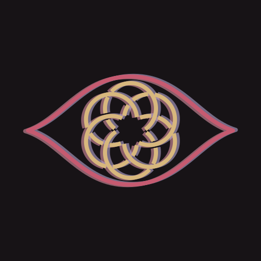
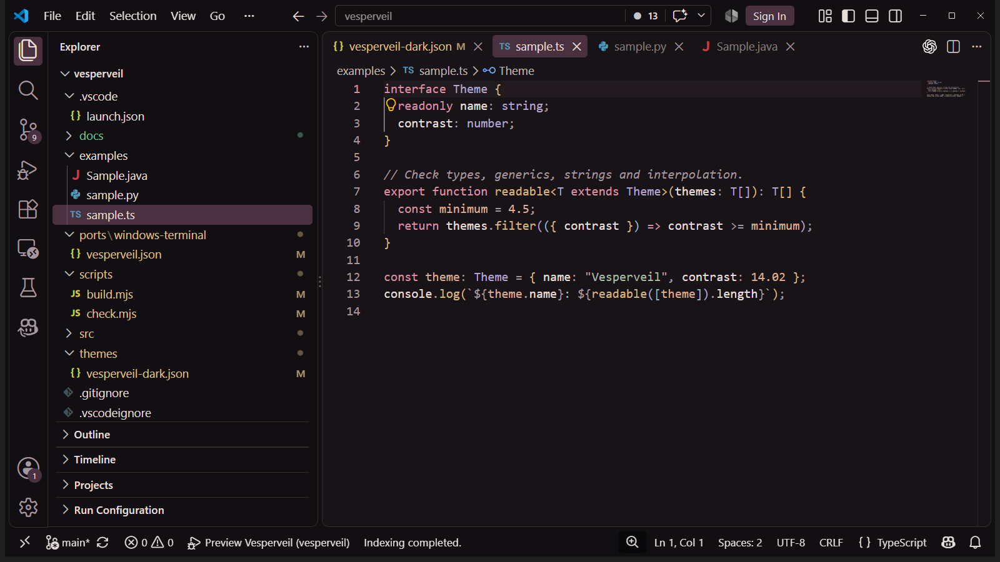
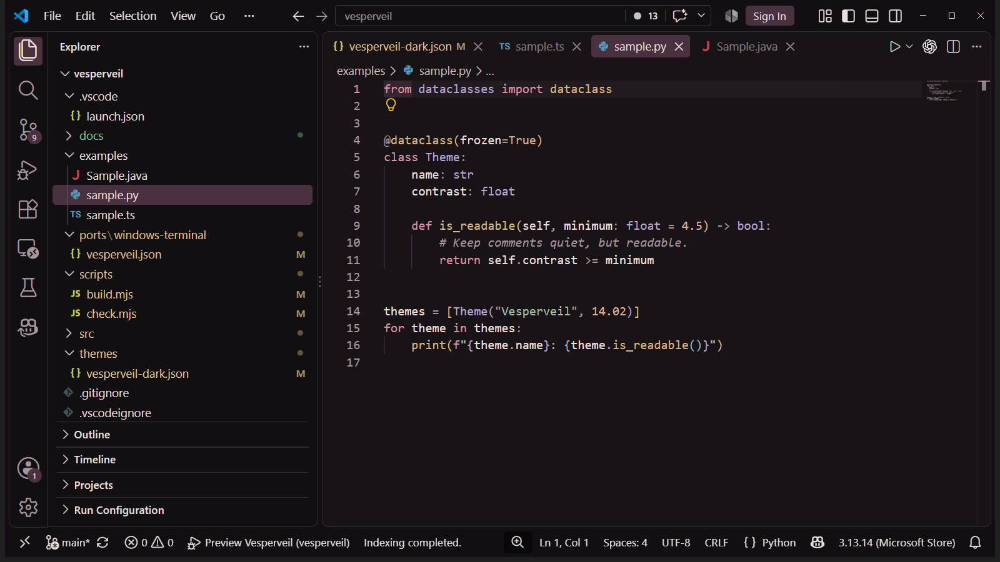

# Vesperveil



A dark theme with wine-tinted surfaces, ivory text and carmine accents.
Subtly inspired by Ronova's palette from Genshin Impact. An independent project;
no official artwork is included.

[Explore Vesperveil — palette, screenshots and details](https://muowl.dev/themes/vesperveil/)

## Installation

Install the extension, then open **Preferences: Color Theme** and select
**Vesperveil Dark**. To install a downloaded `.vsix`, run
**Extensions: Install from VSIX...** from the Command Palette.

Selected VS Code editor and terminal states have been visually reviewed.
Cursor and a full interaction review are still pending.

## Screenshots

Real VS Code captures with Vesperveil Dark. UI zoom is increased for readability;
file icons and language-specific decorations depend on installed extensions.





## Preview in VS Code

Open this directory in VS Code and press F5 using **Preview Vesperveil**.
In the Extension Development Host, choose **Vesperveil Dark** using
**Preferences: Color Theme**, then open the files in `examples/`.
Use the usual language extensions for Python and Java semantic highlighting.
The Java fixture requires Java 17 or newer if executed; execution is not required
for previewing the theme.

The same color-theme extension is intended for Cursor, but Cursor-specific surfaces
have not been verified. The theme changes colors only, not fonts or layout.
Comments use italics; other syntax categories use normal font style.

## Development

Node.js 20 or newer; no build dependencies.

```sh
npm run build
npm run check
```

Edit `src/palette.json` for base colors. `scripts/build.mjs` assigns semantic roles
and generates the editor and terminal files. Do not edit generated files directly.
Checks cover selected text/background contrast pairs, color format, comment-only
italics, and shared ANSI values. These checks do not establish complete accessibility
or guarantee that every language grammar maps to the intended scope.

## Windows Terminal

Download [`ports/windows-terminal/vesperveil.json`](https://github.com/Muowl/vesperveil/blob/main/ports/windows-terminal/vesperveil.json)
from the repository and add its object to the `schemes` array
in Windows Terminal's settings JSON. Set `colorScheme` to `Vesperveil Dark` on the
chosen profile (or in `profiles.defaults`). Preserve existing schemes and settings.
The export contains all 16 ANSI colors, foreground, background, selection and cursor.

## Before publication

- Review Python, TypeScript and Java in VS Code and Cursor, with semantic highlighting
  on and off. Inspect token scopes where grammar results differ.
- Review completion menus, search, diff views, errors, selections and terminal ANSI colors.
- Use the `muowl` publisher / namespace on both registries (`muowl.vesperveil`).
- Refresh the included screenshots if the theme changes.
- Package with the official VS Code packaging tool and test the VSIX locally.
- Publish the reviewed package to both registries.

## References

- https://code.visualstudio.com/api/extension-guides/color-theme
- https://code.visualstudio.com/api/language-extensions/semantic-highlight-guide
- https://learn.microsoft.com/en-us/windows/terminal/customize-settings/color-schemes

## License

MIT. See [LICENSE](LICENSE).
